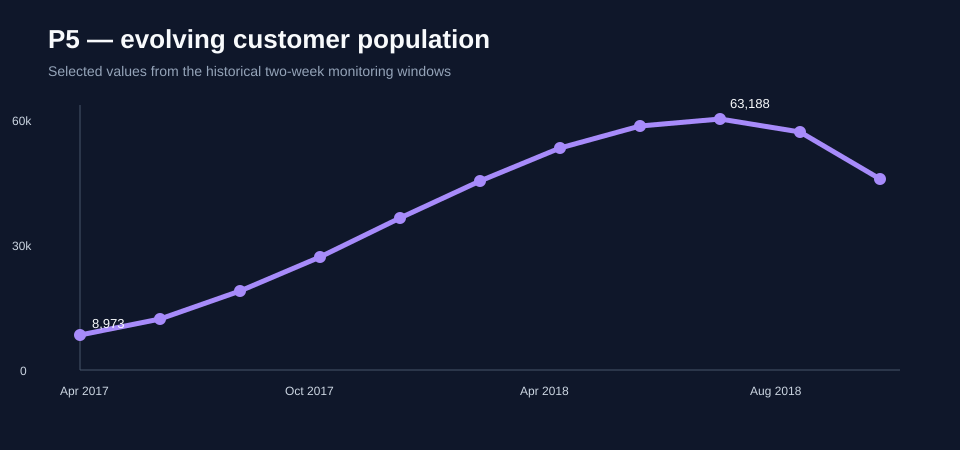

# E-commerce Customer Segmentation

An explainable RFM and clustering pipeline for the public Olist e-commerce dataset. The project turns exploratory customer analysis into reusable, testable code suitable for a Data Science portfolio.

## Business question

How can an e-commerce team group customers by recency, frequency and monetary value to adapt retention campaigns without exposing personal data?

## Workflow

```text
public Olist tables → order-level joins → RFM features → scaling → K-means → segment profile
```

## Quick start

```bash
python -m venv .venv
pip install -e .[dev]
pytest
jupyter lab notebooks/customer_segmentation.ipynb
```

Raw Olist CSVs belong in `data/raw/` and are never committed. The repository contains no database credentials and does not require MariaDB.

## Case-study gallery

The original `master` and `dev` branches evolved from a single notebook into several focused experiments. This public version preserves that breadth in a readable sequence:

| Study | Focus |
|---|---|
| [01 — RFM exploration](notebooks/01_rfm_exploration.ipynb) | recency, frequency, monetary definitions and edge cases |
| [02 — Cluster selection](notebooks/02_cluster_selection.ipynb) | scaling, K-means, inertia and silhouette trade-offs |
| [03 — Review signals](notebooks/03_review_signals.ipynb) | enrich segments with satisfaction evidence without leaking it into RFM |
| [04 — Stability simulation](notebooks/04_stability_simulation.ipynb) | monitor assignment drift and choose a refresh cadence |
| [05 — Data-access contract](notebooks/05_data_access_contract.ipynb) | replace embedded MariaDB credentials with an injected, validated table contract |
| [End-to-end demo](notebooks/customer_segmentation.ipynb) | reproducible synthetic workflow |
| [06 — Historical evidence](notebooks/06_historical_evidence.ipynb) | verified Olist scale, segment design and temporal-monitoring protocol |

## Historical evidence and current competencies

The executed research notebooks demonstrate a production-minded segmentation study:

- **111,151 prepared transaction rows** and **95,380 unique customers** after joins and quality controls;
- RFM construction with an explicit reference date, plus average review score as a fourth interpretation feature;
- quintile scoring and ten actionable profiles: Champions, Loyal Customers, Potential Loyalists, New Customers, Promising, Need Attention, About to Sleep, At Risk, Cannot Lose and Hibernating;
- KMeans experiments over scaled Recency, Frequency, Monetary and Score features;
- temporal stability monitoring with **adjusted Rand index**, two-week periods and several initial customer cohorts;
- comparison between a frozen initial model and models refitted as customer behaviour evolves.



The [experiment inventory](docs/experiment_inventory.md) explains how all seven notebooks from `master` and `dev` are represented without publishing credentials or raw customer records.

## Engineering choices

- deterministic feature dates and random seeds;
- explicit validation of required columns;
- separate RFM feature engineering and clustering;
- synthetic tests that exercise customer histories safely;
- cluster quality and temporal stability are treated as separate evaluation questions;
- MIT-licensed code, with source datasets governed separately.

## License

Released under the [MIT License](LICENSE).

